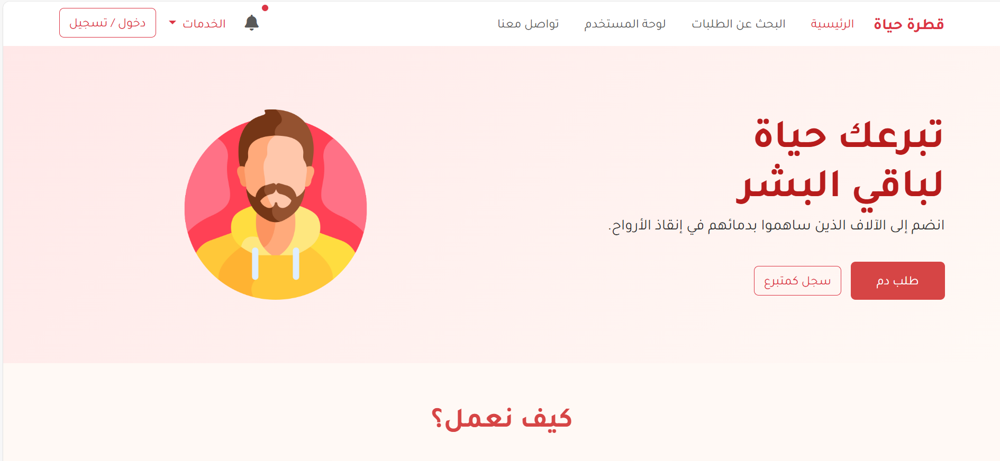
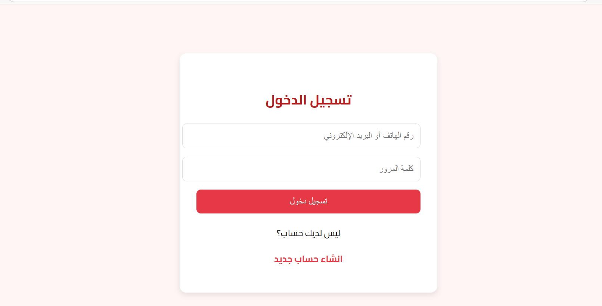
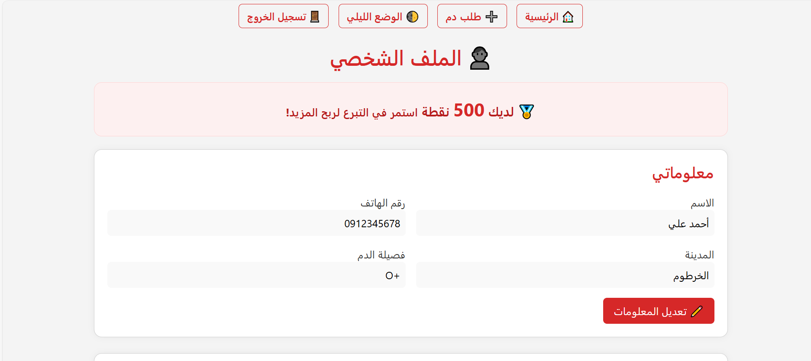
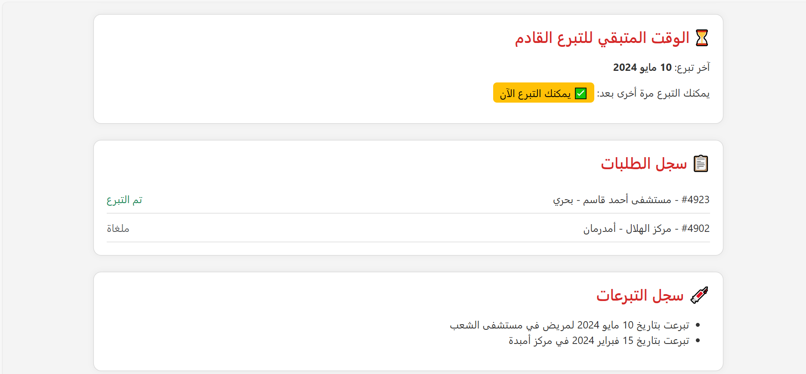
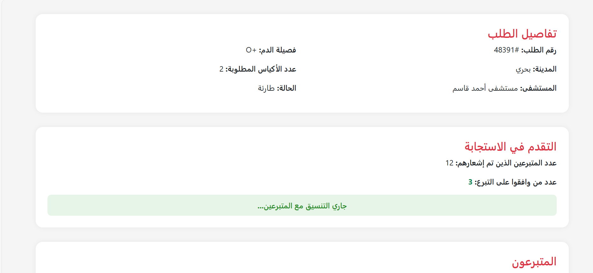
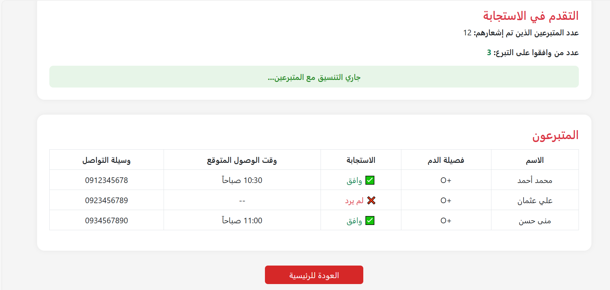
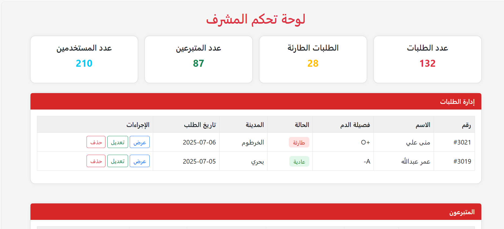

# 💧 قطرة حياة - Qatrat Hayat

**منصة تبرع بالدم رقمية** تساعد في ربط المحتاجين للدم بالمتبرعين القريبين منهم في السودان.

---

## 🚀 فكرة المشروع

"قطرة حياة" هو موقع ويب يهدف إلى تسهيل وتسريع عملية التبرع بالدم في السودان من خلال:

- التسجيل كمُتبرع بالدم وتحديد الفصيلة والموقع.
- استقبال تنبيهات في حال وجود محتاج لفصيلة دمك.
- سجل تبرعات ونظام نقاط تحفيزي.
- دعم الجهات الرسمية (المستشفيات وبنوك الدم).

---

## 👤 الفئات المستهدفة

1. **المتبرعون بالدم**
2. **طالبي الدم (المرضى/ذووهم)**
3. **الجهات الطبية (مستشفيات - بنوك دم)**

---

## 🧭 واجهة المستخدم (UI)

### الصفحة الرئيسية

### صفحة التسجيل

### الملف الشخصي

### حالة الطلب

### لوحة تحكم المشرف (Admin)

---

---

## 🛠️ التقنيات المستخدمة

- ✅ HTML
- ✅ CSS
- ✅ Bootstrap 
- ✅ Google Fonts (Cairo)

---

## 📌 المميزات

- إشعارات ذكية حسب الفصيلة والموقع
- نظام نقاط وتحفيز للمتبرعين
- إمكانية تعديل الملف الشخصي وسجل التبرعات
- دعم الجهات الطبية الرسمية
- واجهة عربية كاملة وسهلة الاستخدام

---

## 🧪 طريقة التشغيل

1. فك الضغط عن المشروع.
2. افتح `home.html` باستخدام المتصفح.
3. لا حاجة لتثبيت شيء، لأن Bootstrap يعمل عبر CDN.

---

---

---

هذا المشروع مفتوح المصدر ضمن مسابقة Code for Sudan ✌️

